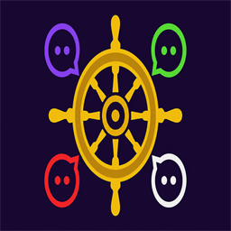

# Captain Multi Chat

Unified **Twitch**, **Kick**, **YouTube**, and **X** chat dock for **OBS Studio** on Windows.

## Download

| Installer | Description |
|-----------|-------------|
| **[CaptainMultiChat-Setup.exe](https://github.com/CaptainDark/captain-multi-chat-releases/releases/latest)** | One-click Windows installer (recommended) |
| **[CaptainMultiChat-Portable.zip](https://github.com/CaptainDark/captain-multi-chat-releases/releases/latest)** | Zip package — run `Install-Portable.cmd` after extract |

**Requirements:** Windows 10/11 (64-bit), [OBS Studio 32+](https://obsproject.com) (64-bit)

## Quick start

1. Install OBS Studio if you have not already.
2. Download and run **CaptainMultiChat-Setup.exe** (close OBS first).
3. Open OBS → **Docks** → **Captain Multi Chat**.
4. Click **Settings** and connect your platforms.

## Verify download (optional)

Compare SHA256 hashes listed on each [Release](https://github.com/CaptainDark/captain-multi-chat-releases/releases) page.

## Support

- [Release notes & downloads](https://github.com/CaptainDark/captain-multi-chat-releases/releases)
- Source and development: private repository (not public)

© Captain Dark. Proprietary software.
